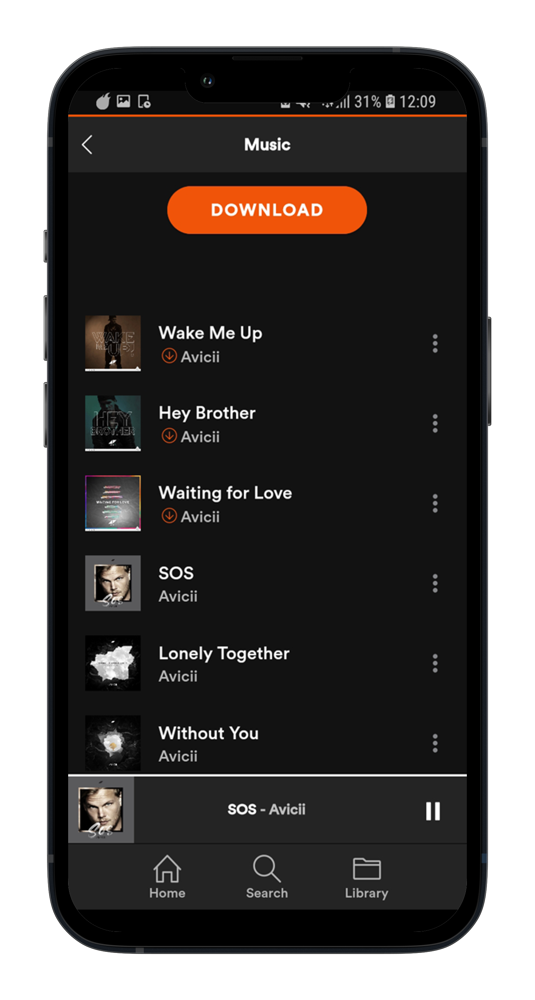

  

  <strong>Frontend Engineer</strong>

    

  <!-- Firefly Project -->
  
   
  <i>Firefly - A music app built with Flutter</i>
    
  
   
  <i>See the project <a href="https://github.com/lookacat/firefly-music-app" target="_blank">here 🔗</a></i>
    

  <!-- Cloud Gallery Project -->
  
   
  <i>Cloud Gallery - A Flutter-based cloud image gallery</i>
    
  
   
  <i>See the project <a href="https://github.com/lookacat/cloud-gallery" target="_blank">here 🔗</a></i>

